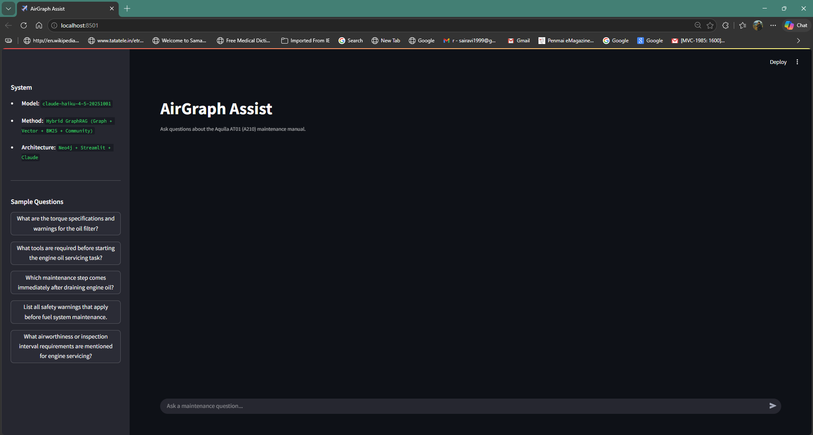
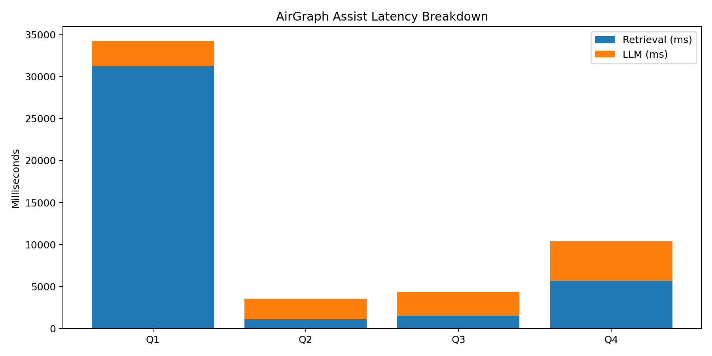

# AirGraph Assist ✈️
### GraphRAG for Aircraft Maintenance Intelligence

AirGraph Assist answers safety-critical aviation maintenance questions from long
technical manuals using **hybrid GraphRAG** — combining graph traversal, vector
similarity, BM25 keyword search, and community summaries over a Neo4j knowledge
graph, with answers generated by Claude.

This repository is a **monorepo** split for cloud deployment:

```
.
├── backend/    → FastAPI GraphRAG API   (deploy to Railway)
├── frontend/   → Next.js chat UI        (deploy to Vercel)
└── assets/     → README media
```

---

## Architecture

```text
PDF
  → Procedure-aware chunking
  → Schema-validated entity + relationship extraction
  → Embedding generation
  → Neo4j graph build (constraints + fulltext + vector index)
  → Community detection (Louvain)
  → Hybrid retrieval (Graph + Vector + BM25 + Community)
  → Claude answer generation
  ─────────────────────────────────────────────
  FastAPI  ──HTTP/JSON──►  Next.js UI
 (Railway)                 (Vercel)
```

- **`backend/`** — the Python pipeline (`data/`, `graph/`, `retrieval/`, `llm/`,
  `pipeline.py`, `config.py`) wrapped by a FastAPI app (`main.py`).
- **`frontend/`** — a Next.js app: chat interface, live knowledge-graph
  visualisation, latency breakdown, and a "how it works" guide.

See [`backend/README.md`](backend/README.md) and
[`frontend/README.md`](frontend/README.md) for per-app details.

## Quick start (local)

Run the two apps in separate terminals.

**1. Backend**

```bash
cd backend
python -m venv .venv
.venv\Scripts\activate          # Windows  (use: source .venv/bin/activate on macOS/Linux)
pip install -r requirements.txt
copy .env.example .env          # fill in ANTHROPIC_API_KEY + NEO4J_* values
uvicorn main:app --reload --port 8000
```

**2. Frontend**

```bash
cd frontend
npm install
copy .env.example .env.local    # NEXT_PUBLIC_API_URL=http://localhost:8000
npm run dev
```

Open http://localhost:3000.

## Deployment

| Part      | Platform | Root directory | Key settings                                  |
| --------- | -------- | -------------- | --------------------------------------------- |
| Backend   | Railway  | `backend`      | env: `ANTHROPIC_API_KEY`, `NEO4J_*`, `ALLOWED_ORIGINS` |
| Frontend  | Vercel   | `frontend`     | env: `NEXT_PUBLIC_API_URL` = Railway URL      |
| Database  | Neo4j Aura | —            | free tier; copy the bolt URI + password       |

Deploy order: **Neo4j Aura → backend (Railway) → frontend (Vercel)**, then set
`ALLOWED_ORIGINS` on Railway to your Vercel domain.

## Dataset

- **Source**: Aquila AT01 (A210) maintenance documentation (EASA Part-M style)
- **Committed artefacts** (`backend/data/`): `chunks.json`, `entities.json`,
  `embeddings.json`, `communities.json` — so the API runs without re-running the
  pipeline.

## Evaluation

```bash
cd backend
python evaluation/run_evaluation.py
pytest -q
```

Outputs land in `backend/evaluation/metrics/` and `backend/evaluation/images/`.

## Demo

[](assets/AirGraph.mp4)

### Latency Breakdown


### Quality Scores


## License

MIT
