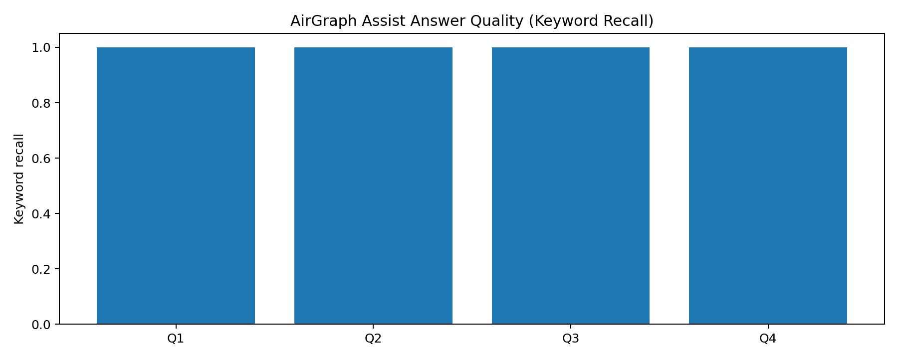

# AirGraph Assist ✈️
### GraphRAG for Aircraft Maintenance Intelligence

AirGraph Assist is a GraphRAG project built to answer safety-critical aviation maintenance questions from long technical manuals with source-aware, structured retrieval.

---

## What Is This?

AirGraph Assist converts an aircraft maintenance manual into a queryable knowledge graph and combines:

- Graph traversal (typed relationships)
- Vector similarity search
- BM25 keyword retrieval
- Community-level graph summaries

The result is a maintenance assistant that can answer questions like:
"What are the torque specs and warnings for the oil filter?" with stronger grounding than plain chunk-based RAG.

## Why I Built This

I built this project to solve a real retrieval gap in technical documentation:

- Warnings and procedure steps are often split across pages/chunks.
- Traditional RAG loses relationship meaning between entities.
- Safety workflows require traceable answers, not approximate similarity only.

This project was created to explore how graph structure improves recall, explainability, and safety-context retrieval.

## Dataset Used

- **Primary source**: Aquila AT01 (A210) maintenance documentation (EASA Part-M style manual)
- **Input format**: PDF
- **Pipeline artifacts generated**:
  - `data/chunks.json`
  - `data/entities.json`
  - `data/embeddings.json`
  - `data/communities.json`

## Architecture

```text
PDF
  -> Procedure-aware Chunking
  -> Schema-validated Extraction (entities + relationships)
  -> Embedding Generation
  -> Neo4j Graph Build (constraints + fulltext + vector index)
  -> Community Detection (Louvain)
  -> Hybrid Retrieval (Graph + Vector + BM25 + Community)
  -> Claude Answer Generation
  -> Streamlit UI
```

### Core modules

- `data/` -> chunking, extraction, embedding, schema
- `graph/` -> Neo4j graph build + community generation
- `retrieval/` -> hybrid retriever
- `llm/` -> Claude client wrapper
- `pipeline.py` -> end-to-end query orchestration
- `app.py` -> Streamlit app

## Results

From development/evaluation runs, the GraphRAG approach improves:

- warning-to-step linkage retrieval
- component/tool relationship recall
- empty retrieval fallback robustness
- context quality for technical question answering

> Note: Final answer quality depends on valid Anthropic credentials and a populated Neo4j graph.

## Installation

### Prerequisites

- Python 3.11+
- Neo4j 5.x running on `bolt://localhost:7687`
- Anthropic API key

### Setup

```bash
git clone https://github.com/Sharan099/graphRAG.git
cd graphRAG
pip install -r requirements.txt
```

### Environment variables

```bash
# Windows (PowerShell)
$env:ANTHROPIC_API_KEY="sk-ant-..."
$env:NEO4J_PASSWORD="your_neo4j_password"

# Linux / macOS
export ANTHROPIC_API_KEY="sk-ant-..."
export NEO4J_PASSWORD="your_neo4j_password"
```

## Usage

### Build pipeline artifacts

```bash
python data/chunker.py
python data/extractor.py
python data/embedder.py
python graph/builder.py
python graph/community.py
```

### Run application

```bash
streamlit run app.py
```

### Run evaluation

```bash
python evaluation/run_evaluation.py
pytest -q
```

Evaluation outputs:

- `evaluation/metrics/summary.json`
- `evaluation/metrics/query_results.csv`
- `evaluation/images/latency_breakdown.png`
- `evaluation/images/quality_scores.png`

## Future Work

- Add automatic pre-run health checks for Neo4j + Anthropic credentials
- Add regression benchmark suite with golden question-answer pairs
- Add model/provider abstraction for multi-LLM evaluation
- Add CI workflow for evaluation artifact generation
- Improve graph retrieval ranking with learned relevance weighting

## Demo Video

- Add your demo link here: [Demo Video](https://example.com/demo)
<video width="800" controls>
  <source src="assets/graphrag-demo.mp4" type="video/mp4">
</video>

## Metrics Screenshot / Image

### Latency Breakdown


### Quality Scores


## License

MIT